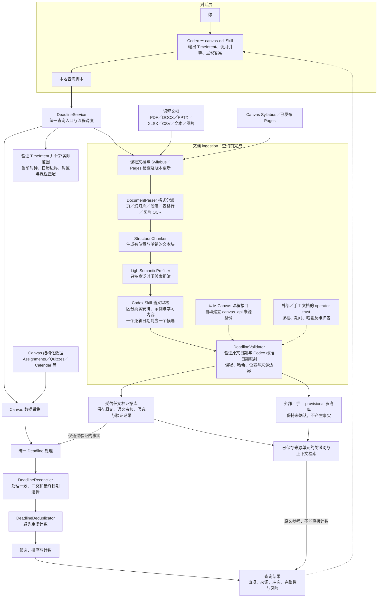

# canvas-ddl 架构图

这张图展示对话层、本地引擎、实时 Canvas 数据及多格式课程文档证据库之间的职责和数据流。

Codex 负责理解问题，也只通过引擎发出的有界文本块提出语义候选；
DeadlineService 负责调度，引擎负责验证、最终日期和计数。
Canvas Files、Syllabus 和 Pages 由认证课程接口自动建立来源身份，不走人工批准；
外部或手工文件仍由维护者建立 operator trust。Codex 不决定来源身份。
仅文档记载的事项也可在来源受信、标准日期与原文映射通过独立验证后成为已确认事项。
OCR 只在新文件或变更文件 ingestion 时本地运行；置信度不足的 OCR 候选保持未确认，
最终查询只读取已持久化的来源单元证据，并重新验证语义审核能否精确重建候选。
同一事项与实时 Canvas 日期冲突时默认 Canvas 优先，并保留文档替代值与来源。

详细契约见 [ARCHITECTURE.md](ARCHITECTURE.md) 和 [运行 Skill](../skills/canvas-ddl/SKILL.md)。

Codex 把自然语言时间解释为 TimeIntent；TimeRangeResolver 使用实际时钟验证并计算边界，结果附原始意图和时间范围。
