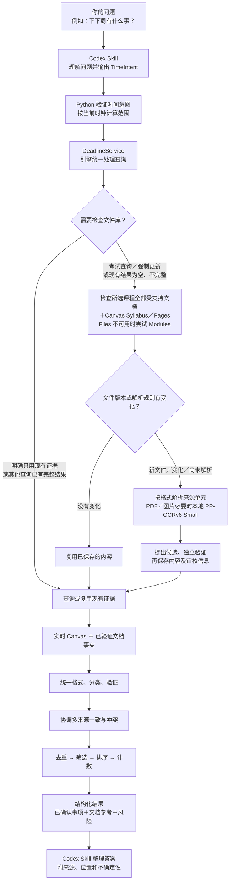

# canvas-ddl 查询流程图

这张图说明问题如何经过文件库检查、多来源证据处理和结构化计数，最后形成回答。

考试查询检查所有选中课程的可访问受支持文档和 Canvas 课程内容；相同版本且解析审核有效时复用内容。
未批准来源和未通过验证的候选只作为参考，不参与已确认事项计数。
Files 权限失败后的 Modules 检索属于部分覆盖；失败与不确定性随结果返回。

详细契约见 [ARCHITECTURE.md](ARCHITECTURE.md) 和 [运行 Skill](../skills/canvas-ddl/SKILL.md)。

时间意图由 Codex 理解；实际范围只由 Python 计算，文件更新期间保持同一范围。
